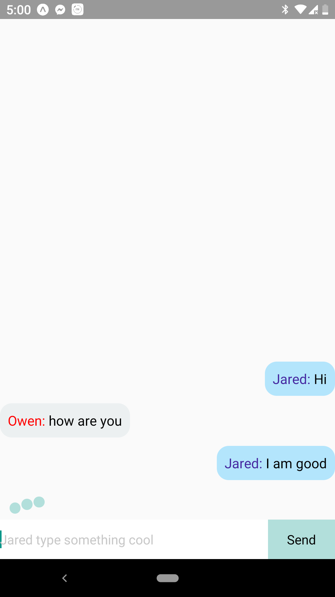

# MiniChat FrontEnd

Implented with React Native and sockt.io. Everyone Using the app will be given a random user name from the server and an id will be saved in the device. Every User is part of a chat room. User can send messages in realtime. A typing indicator is displayed to show other user is typing. For Server Use [MiniChat Server](https://github.com/Jashem/MiniChat_Server)

### Usage

In ./components/Chat.js file line 20 add your server address in io(server address)

To install dependencies

```bash
npm install
```

start the client app.

```bash
 expo start --android
```

### Demo



### TODO

- Add pagination
- Add read receipts that show to a user that a message has been read by another user
- Add image and gif support
